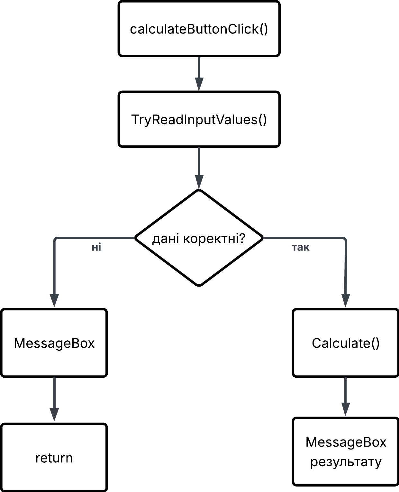

# Лабораторна робота №1

## Інструментальні засоби візуального програмування

### Вступ

Мета роботи полягає в ознайомленні із середовищем Microsoft Visual Studio, створенні застосунків Windows Forms мовою C#
та використанні базових елементів графічного інтерфейсу.
У межах роботи реалізовано обробку подій елементів керування, введення числових даних, обчислення математичного виразу та виведення результату.

## Завдання 1. Виведення повідомлення

Створено форму з кнопкою `Приклад1`. Для кнопки реалізовано обробник події `Click`, який виводить повідомлення за допомогою методу `MessageBox.Show()`.

```csharp
private void button1_Click(object sender, EventArgs e)
{
    MessageBox.Show("Ви натиснули кнопку Приклад1");
}
```


## Завдання 2. Обчислення математичного виразу

$$
s =
\frac{2\cos\left(x-\frac{2}{3}\right)}
{\frac{1}{2}+\sin^2 y}
\left(
1+\frac{z^2}{3-\frac{z^2}{5}}
\right)
$$

Створено окрему форму `CalculationForm` для введення початкових значень `x`, `y`, `z` та обчислення значення заданого математичного виразу.

Для перевірки використовуються початкові дані:

```
x = 14.26
y = -1.22
z = 0.035
```

Контрольне значення результату: `s = 0.749155`

Форма містить поля введення `xTextBox`, `yTextBox`, `zTextBox`, кнопку Обчислити та кнопку Закрити.

Логіка роботи:

Алгоритм обчислення представлено на діаграмі алгоритму



Після натискання кнопки Обчислити виконується обробник `calculateButtonClick()`. 

```csharp
private void calculateButtonClick(object sender, EventArgs e)
{
    if (!TryReadInputValues(out double x, out double y, out double z))
    {
        return;
    }

    double result = Calculate(x, y, z);

    MessageBox.Show($"s = {result:F6}");
}
```

Він викликає метод `TryReadInputValues()`, який перевіряє введені значення та перетворює їх у тип `double`.

```csharp
private bool TryReadInputValues(out double x, out double y, out double z)
{
    bool xValid = double.TryParse(xTextBox.Text, out x);
    bool yValid = double.TryParse(yTextBox.Text, out y);
    bool zValid = double.TryParse(zTextBox.Text, out z);

    if (!xValid || !yValid || !zValid)
    {
        MessageBox.Show(
            "Введіть коректні числові значення x, y та z.",
            "Помилка введення",
            MessageBoxButtons.OK,
            MessageBoxIcon.Warning
        );

        return false;
    }

    return true;
}
```

Якщо хоча б одне значення введено некоректно, користувачу виводиться повідомлення про помилку і обчислення припиняється.


Якщо всі значення коректні, вони передаються до методу `Calculate()`. Метод виконує обчислення заданого математичного виразу та повертає результат. Отримане значення виводиться в окремому вікні за допомогою `MessageBox.Show()`.

```csharp
private double Calculate(double x, double y, double z)
{
    return
        (2 * Math.Cos(x - 2.0 / 3.0)) /
        (1.0 / 2.0 + Math.Pow(Math.Sin(y), 2)) *
        (1.0 + Math.Pow(z, 2) /
        (3.0 - Math.Pow(z, 2) / 5.0));
}
```

Отриманий результат відповідає контрольному значенню:


